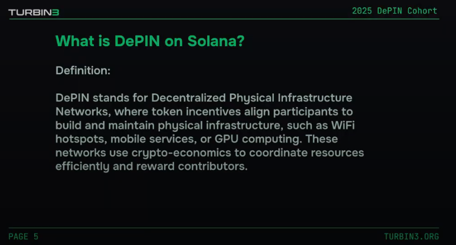
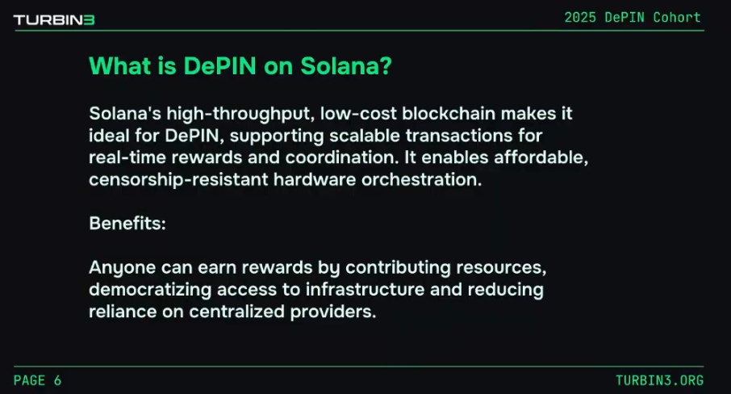
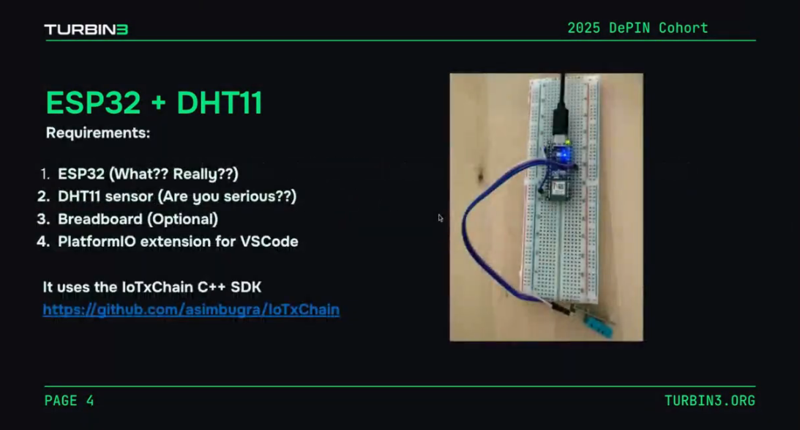

# DePIN Cohort

## Day 1

### Session Summary

**Topic:** Building a Solana client SDK from scratch

**Key Concepts:**
- Building a client that interacts with the blockchain
- Focus on implementing only what's needed for your project use case, not the entire library
- Transaction structure: Array of signatures + message
- Connection components: commitment, httpAgent, wsEndpoint, httpHeaders, fetch, etc.
- Token transfers require: ATA program, token program, mint
- Working on DEVNET

**Hardware Discussion:**
- **ESP32 Devkit** recommended (~$3-10, has WiFi + Bluetooth)
  - ESP32-S2 mini is sufficient if WiFi-only (no Bluetooth needed)
- **NVIDIA Jetson Nano** (~$500, good for remote validators)
- **Zymkey4i** - Hardware security module for Raspberry Pi (expensive but good)
- **PlatformIO IDE for Cursor** extension recommended for development

**Presented by:** Shrinath (building custom Solana SDK for embedded devices)

### Resources & Links

#### Articles & Documentation
- [Why Every Major DePIN Project is Migrating to Solana](https://medium.com/@hrknsinst/why-every-major-depin-project-is-migrating-to-solana-and-what-this-reveals-about-the-a3269ea431a7) - Medium article by daniel asaboro
- [Solana Transactions Documentation](https://solana.com/docs/core/transactions#message-header) - Transaction message structure

#### Hardware
- [NVIDIA Jetson Nano](https://www.nvidia.com/en-us/autonomous-machines/embedded-systems/jetson-nano/product-development/) - Product development page
- [Zymkey4i](https://store.zymbit.com/products/zymkey4i) - Hardware security module for Raspberry Pi

#### Solana SDKs & Examples
- [Solana web3.js](https://github.com/solana-foundation/solana-web3.js) - Official Solana web3.js library
- [Solana web3.js Connection](https://github.com/solana-foundation/solana-web3.js/blob/maintenance/v1.x/src/connection.ts) - Connection implementation reference
- [Solana SDK Example](https://github.com/saicharanpogul/SolanaSDKExample) - Example SDK implementation
- [SolanaSDK Project](https://github.com/3uild-3thos/project_axs/tree/main/lib/SolanaSDK/src/SolanaSDK) - Custom SDK implementation by Shrinath
- [Agave SDK](https://github.com/anza-xyz/agave/blob/v2.1.13/sdk/program/src/message/mod.rs#L97) - Agave transaction message implementation

#### IoT & DePIN Projects
- [IoTxChain](https://github.com/asimbugra/IoTxChain) - IoT blockchain project

### Reference Repositories
- helium-program-library
- unruggable-rust-esp32
- depin-reward-distributor

### Personal Research Notes

Reference: Helium [Twitter Post](https://x.com/Heliumdeploy/status/1984067947028009162)

> Every top location shares 3 traits:
> 
> 1. Indoor placement
> 2. High foot traffic density → shoppers, employees, commuters
> 3. Access & visibility → malls, highways, downtown corridors
> 
> 🔍 Replicate these traits anywhere:
> 
> 1. Indoor venues with steady visitors
> 2. Proximity to roads or transit
> 3. Surrounding population with high mobile usage
